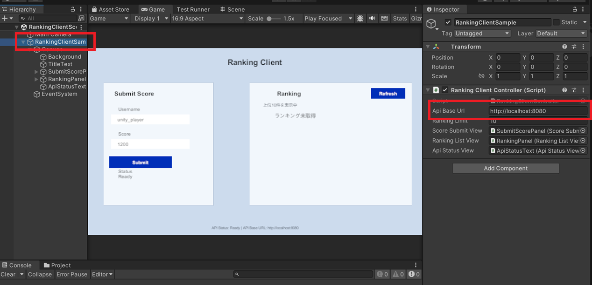

# Unity Ranking API

## 概要

UnityクライアントとFastAPIサーバーを連携させた、シンプルなランキング機能のサンプル実装です。

Unityからユーザー名とスコアを送信し、サーバー側でPostgreSQLに保存します。
保存されたスコアはランキングとして取得でき、Unityクライアント上で表示できます。
Docker ComposeでAPIサーバー、DB、Adminer（データベースの確認用）を起動する想定です。


## 主な機能

- Unityクライアントからスコアを登録
- スコア順のランキングを取得
- 登録したスコアの順位を取得（同点スコアは同順位として扱う）
- PostgreSQLにランキングデータを保存

## 技術構成

- Unity 2022.3.14f1
- FastAPI / Python
- PostgreSQL
- SQLModel
- Docker / Docker Compose
- Adminer

## 必要環境

- Docker Compose (サーバー用)
- Unity 2022.3.14f1 (クライアント用)

## インストール
このプロジェクトでは、APIサーバー、PostgreSQL、AdminerをDocker Composeで起動します。
初回は `.env` を作成してから、Docker Composeを実行してください。

### 1. `.env` を作成

`unity-ranking-api\.env.example` をコピーして `unity-ranking-api\.env` を作成します。

### 2. サーバーを起動

リポジトリ直下でDocker Composeを実行します。

```powershell
docker compose up
```

サーバー起動後は以下にアクセスすることができます。

- API: `http://localhost:8080`
- Swagger UI: `http://localhost:8080/docs`
- Adminer: `http://localhost:8081`

### 3. Unity起動


Unity Hubから以下のプロジェクトを開きます。

```txt
unity-client/ranking-client
```
UnityからサーバーのAPIにアクセスすることができます。

### 4. サーバー停止方法

以下でコンテナを停止することができます。

```
docker compose down
```

PostgreSQLのデータは名前付きvolume `postgres-data` に保存されます。
通常の `docker compose down` では削除されません。

コンテナとDBデータをまとめて削除する場合はコンテナ停止時に以下を実行します。

```
docker compose down -v
```

## Unityクライアント
サンプルシーンは、`Assets/Scenes/RankingClientScene.unity`です。
こちらのシーンでは、APIとの通信を確認することができる簡単なサンプルを実行することができます。

なお、デフォルトのAPI接続先は`http://localhost:8080`となっています。`Ranking Client Controller`コンポーネントの`Api Base Url`を変更することで、接続先を変更することもできます。


## APIの説明

### `GET /`

APIサーバーの動作確認用エンドポイントです。

Response:

```json
{
  "message": "Hello World"
}
```

### `GET /health/db`

FastAPIからPostgreSQLへ接続できるか確認します。

Response:

```json
{
  "database": "ok"
}
```

### `POST /scores`

スコアを登録します。

Request:

```json
{
  "username": "test_player",
  "score": 1234
}
```

Response:

```json
{
  "username": "test_player",
  "score": 1234,
  "id": 1
}
```

### `GET /ranking`

スコアの高い順にランキングを取得します。
`limit` を省略した場合は最大100件を返します。
`limit` の最大値は500です。

Example:

```txt
http://localhost:8080/ranking?limit=10
```

Response:

```json
[
  {
    "username": "ore",
    "score": 12345,
    "id": 1
  },
  {
    "username": "Nova",
    "score": 9870,
    "id": 2
  }
]
```

### `GET /scores/{score_id}/rank`

登録済みスコアの順位を取得します。
同じスコアは同順位として扱います。

Example:

```txt
http://localhost:8080/scores/1/rank
```

Response:

```json
{
  "username": "test_player",
  "score": 1234,
  "id": 1,
  "rank": 10
}
```

## サンプルデータの利用
データベースに登録するためのサンプルデータを準備しています。
以下を実行することで、デフォルトのサンプルデータ`server/seed_data/sample_scores.json`をデータベースに登録することができます。
```
docker compose exec api python seed.py
```

`--clear`をつけることで、既存のスコアを削除してから、サンプルスコアを投入します。

```
docker compose exec api python seed.py --clear
```

また次のように指定することで、特定のjsonファイルを指定して、データベースを登録することもできます。

```
docker compose exec api python seed.py json_filename
```
`server/seed_data/sample_scores.json`の他に`server/seed_data/manual_test_scores.json` も用意しています。こちらは、AdminerやUnityクライアントから手動入力するときの参考データです。(`seed.py`を利用して、登録することもできます。)

## Adminer

Adminerは以下のURLから利用できます。

```txt
http://localhost:8081
```

接続情報は`.env`に依存しており、デフォルト設定の場合の接続情報は以下のようになります。

```txt
System: PostgreSQL
Server: db
Username: postgres
Password: example_password
Database: ranking
```

## Dev Containers

このリポジトリには、Dev Container設定を含めています。

Dev Containerでは `/workspace` を開き、サーバーディレクトリを `/app` にマウントします。

```txt
/workspace
  リポジトリ全体

/app
  FastAPIサーバーのディレクトリ
```

VS Codeから以下を実行します。

```txt
Dev Containers: Rebuild and Reopen in Container
```

## 参考資料

- [FastAPI](https://fastapi.tiangolo.com/)
- [SQLModel](https://sqlmodel.tiangolo.com/)
- [UnityWebRequest](https://docs.unity3d.com/ScriptReference/Networking.UnityWebRequest.html)
- [Docker Compose](https://docs.docker.com/compose/)
- [Dev Containers](https://code.visualstudio.com/docs/devcontainers/containers)
- [Python Official Image](https://hub.docker.com/_/python)
- [Postgres Docker Official Image](https://hub.docker.com/_/postgres)
- [Adminer Docker Official Image](https://hub.docker.com/_/adminer)
